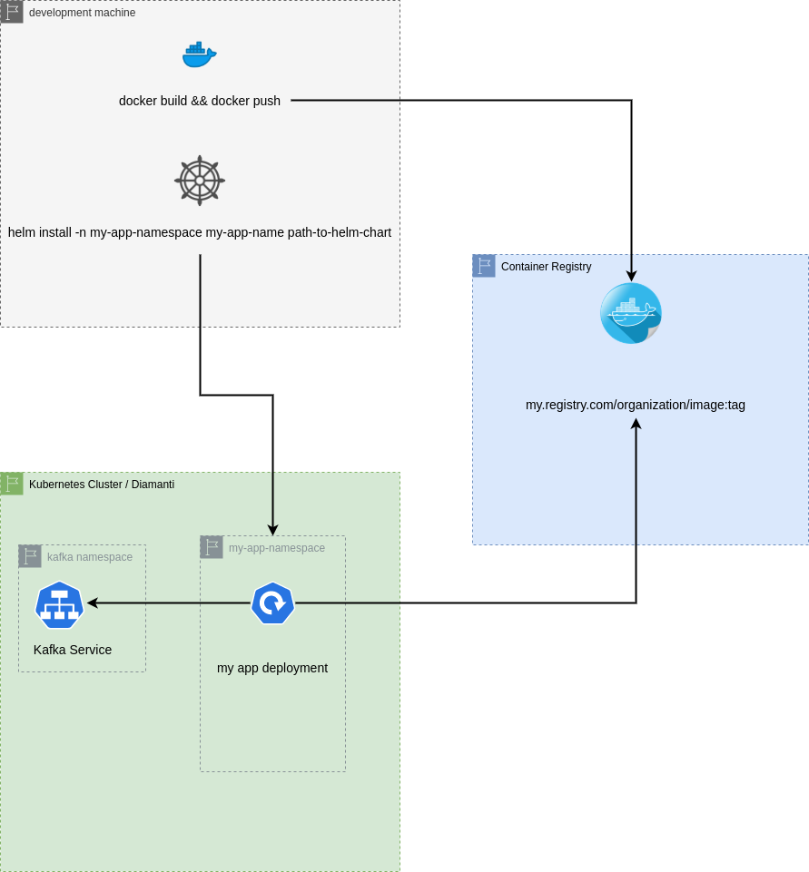

## Main Helm workflow:



## How to Setup this app to run in your Kubernetes cluster

**1) Install Helm 3.**

On windows there are a few options for installing Helm.
- [Install via Chocolatey](https://helm.sh/docs/intro/install/#from-chocolatey-windows)
  if you have chocolatey setup on your system

```
choco install kubernetes-helm
```

- [Download the Windows binary for Helm from the latest stable release](https://github.com/helm/helm/releases/tag/v3.2.4)


**2) Add the [Kafka helm repo to your local Helm](https://github.com/helm/charts/tree/master/incubator/kafka)**

```
helm repo add incubator http://storage.googleapis.com/kubernetes-charts-incubator
```

An alternative [Helm chart for Kafka exists here](https://hub.helm.sh/charts/bitnami/kafka)

It may be worth exploring later which of the two you prefer as they have different options and support.

**3) Deploy Kakfa into your cluster**

The below will install the Kafka service into a namespace `kafka`. The Kafka broker will be accessible within the cluster from the URL: `kafka.kafka.svc.cluster.local:9092`

```
helm install --create-namespace --namespace kafka kafka incubator/kafka
```

**4) Clone the example repo**

```
git clone https://github.com/deltabravo-ai/kafka-example-in-scala.git
```

**5) Install the example app into the cluster**

```
cd kafka-example-in-scala
git checkout -t origin/containerize
helm install --create-namespace --namespace example-app \
  --set kafka.serviceUrl=kafka.kafka.svc.cluster.local:9092 \
  kafka-app charts/kafka-example-in-scala/
```

**6) View logs for the example app**

```
kubectl logs -n example-app -f -l kafkaAppRole=producer
kubectl logs -n example-app -f -l kafkaAppRole=consumer
```

**7) Cleanup**

To remove the example app and all it's associated resources:

```
helm delete -n example-app kafka-app
```


## Resources

[The Helm docs](https://helm.sh/docs/) are thorough. Possibly the best place to begin is [Using Helm](https://helm.sh/docs/intro/using_helm/)

Since Helm charts expose the Kubernetes API directly, it's also important to understand Kubernetes API concepts. A good starting point for this is [Understanding Kubernetes Objects](https://kubernetes.io/docs/concepts/overview/working-with-objects/kubernetes-objects/)

Once you start working with the Kubernetes API directly, you can use [the API Reference](https://kubernetes.io/docs/reference/generated/kubernetes-api/v1.18/) to understand what options are available for each of Kubernetes objects.


### Steps involved in porting a JVM based app to kubernetes:

**1) Create a Dockerfile in your project where:**
  - The base image includes a compatible JVM that can run the compiled .jar file for your project
  - Copies the jar file from wherever you run `docker build` and adds it to the image
  - Specifies the command needed to run your application (this can be overriden later)
**2) docker build**
  - Ex: `docker build --pull --rm -f "Dockerfile" -t adamferguson/dbai-kafkaexampleinscala:latest "."`
**3) docker push**
  - Ex: `docker push adamferguson/dbai-kafkaexampleinscala:latest`
**4) helm create my-app-name**
  This will create a helm 'chart' which includes a default configuration for deploying a basic nginx app
**5) Clean up the files generated by helm create**
  For our purposes we will need the following files:

```
  └── my-app
    ├── charts
    ├── Chart.yaml
    ├── templates
    │   ├── deployment.yaml
    │   ├── _helpers.tpl
    │   └── NOTES.txt
    └── values.yaml

  3 directories, 5 files
```

  The main files are:

  - Chart.yaml - contains high level data describing our helm app, such as version number and app name
  - values.yaml - contains default values for variables that can be interpolated in the helm templates
  - templates/_helpers.tpl - Custom go templates that can be used inside kubernetes configuration files.
                             for applying dynamic logic based on the specified values that are passed to helm
  - templates/*.yaml - kubernetes configuration files that will be applied on the kubernetes cluster. Can contains
                       a mixture of dynamic data and templates mixed with static kubernetes configuration
  - NOTES.txt - Contains output that will be emitted at the conclusion of a helm install. Can contain dynamic data

Within the deployment.yaml we will specify the URL for the container image that was pushed to our registry as well as the command to run the application for our application. The deployment will also need to specify liveness and readiness probes so that kubernetes can tell if the application is up and running.
